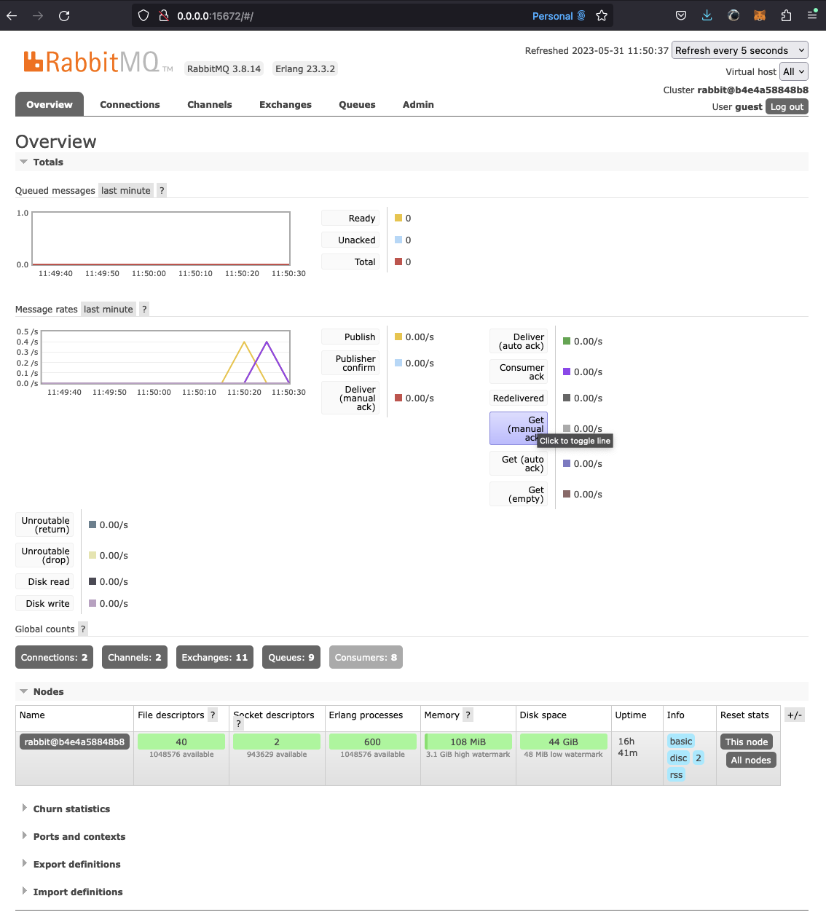
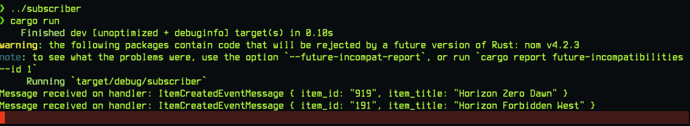
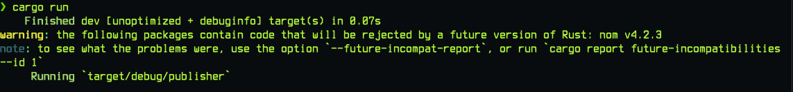

# Rust + RabbitMQ
A simple event driven rust example.

To run rabbitmq with docker:

```bash
$ docker run -d --name rabbitmq rabbitmq:3
```

To access rabbitmq dashboard visit: http://0.0.0.0:15672:


After publisher and subscriber are built, move to the subscriber directory and run subscriber:


```bash
$ cargo run
```

and now in an another terminal session, move to the publisher directory and run publisher:

```bash
$ cargo run
```

You should see the magic happens:



